# 48-Hour Timeline — [ชื่อทีม]

| หัวข้อ | รายละเอียด |
|---|---|
| Time Keeper | [ALTERGROUNDS] |
| Jam เริ่มจริง (วัน-เวลา) | [เช่น ศ. 24 ก.ค. 2569 12:00] |
| Deadline ส่งงาน (วัน-เวลา) | [เช่น อา. 26 ก.ค. 2569 12:00] |

> คำนวณ "เวลาจริง" ของแต่ละ Phase จาก **เวลาที่ Jam เริ่มจริง** ด้านบน แล้วเติมในคอลัมน์ขวาสุด — ใช้ตารางนี้เป็นจุดอ้างอิงเดียวของทีมตลอด 48 ชม.

| Phase | ช่วง (Hour) | เวลาจริง (Hour 0 = เวลาเริ่ม Jam) | เป้าหมาย / Deliverable | สถานะ | เวลาจริงที่เสร็จ |
|---|---|---|---|---|---|
| 0. Kickoff & Ideation | 0–2 | [เวลา] – [เวลา] | Brainstorm game concept, other related shenanigans | 🔲 | |
| 1. Prototyping & Setup | 2–6 | [เวลา] – [เวลา] | Making the repository, Set the project up | 🔲 | |
| 2. Art Direction | 6–14 | [เวลา] – [เวลา] | Parallel to prototyping | 🔲 | |
| 3. Core Mechanic | 14–24 | [เวลา] – [เวลา] | Playable Mechanics | 🔲 | |
| 4. Content & Features | 24–34 | [เวลา] – [เวลา] | video games | 🔲 | |
| 6. Play Test | 34–40 | [เวลา] – [เวลา] | Bugs, Feedbacks, etc. | 🔲 | |
| 7. Addtional Polish | 40–44 | [เวลา] – [เวลา] | SFX, VFX, Lighting, Shaders, etc. | 🔲 | |
| 8. Setting itch page up | 44–47 | [เวลา] – [เวลา] | Presentation File, Itch.io page set up | 🔲 | |
| 9. Buffer & Submit | 47–48 | [เวลา] – [เวลา] | Project building, Submission | 🔲 | |

```mermaid
gantt
    title Game Jam 48 ชั่วโมง — [Vunique Inc.]
    dateFormat  X
    axisFormat %s h
    section Plan
    Kickoff & Ideation        :0, 3h
    Planning & Setup          :3, 3h
    section Build
    Art Direction  :6, 8h
    Core Mechanic :14, 10h
    Content & Features :24, 10h
    section Ship          :34, 6h
    Play Testing                   :40, 4h
    Setting itch page up           :44, 3h
    Buffer & Submit           :47, 1h
```

