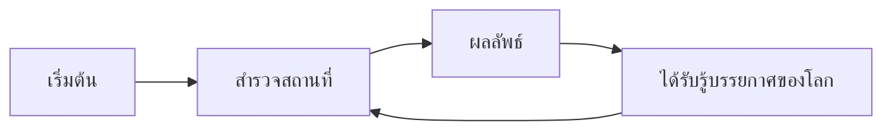

# [WONDERLAND] — Core Loop & Gameplay

## Core Loop

## Core Mechanics
1. แก้ Puzzle ที่หลอกตา
2. Action ต่างๆที่ตรงกับโลก/ด่านที่เราอยู่

## Controls
| Key | Action |
|---|---|
| WASD/Arrow Keys | Move |
| Z | Use Weapon |
| X | Use Item |

## Win / Lose Condition
- **ชนะเมื่อ:** [ออกจากโลกได้]
- **แพ้เมื่อ:** [ใช้เวลามากเกินไป]
